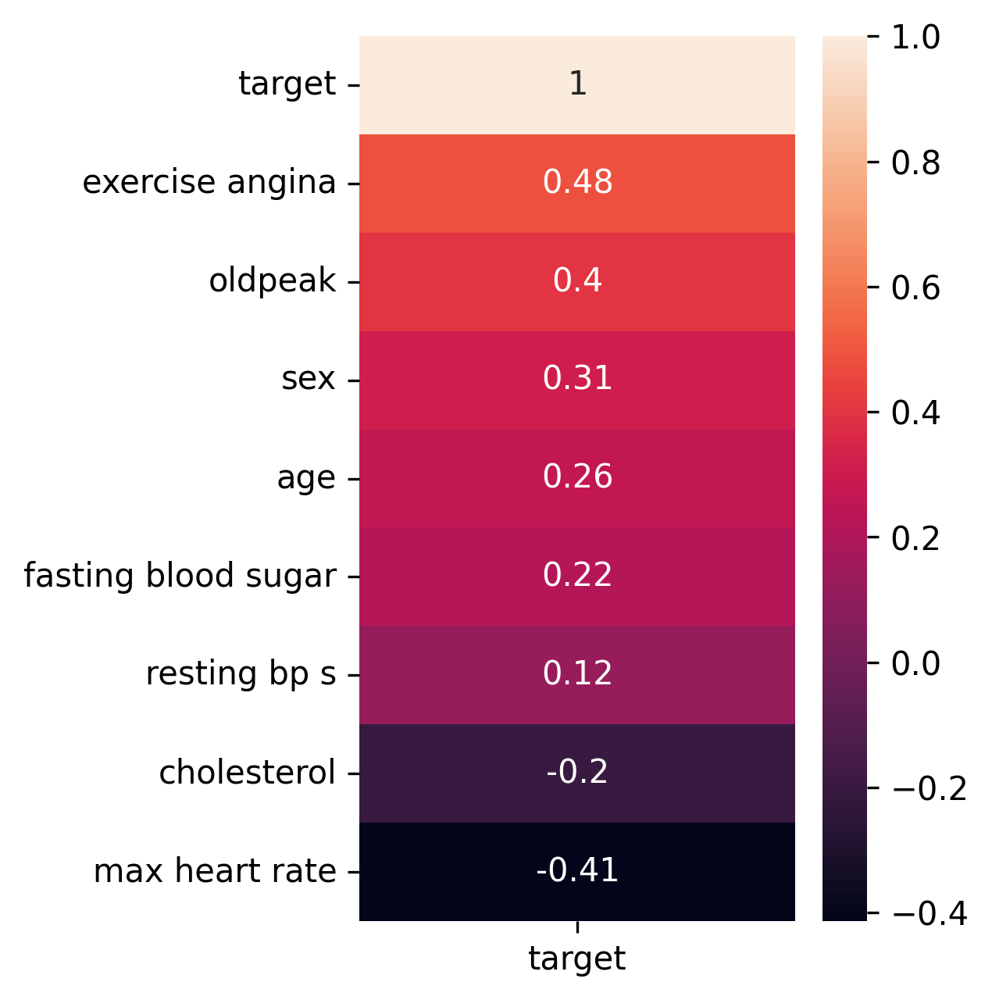
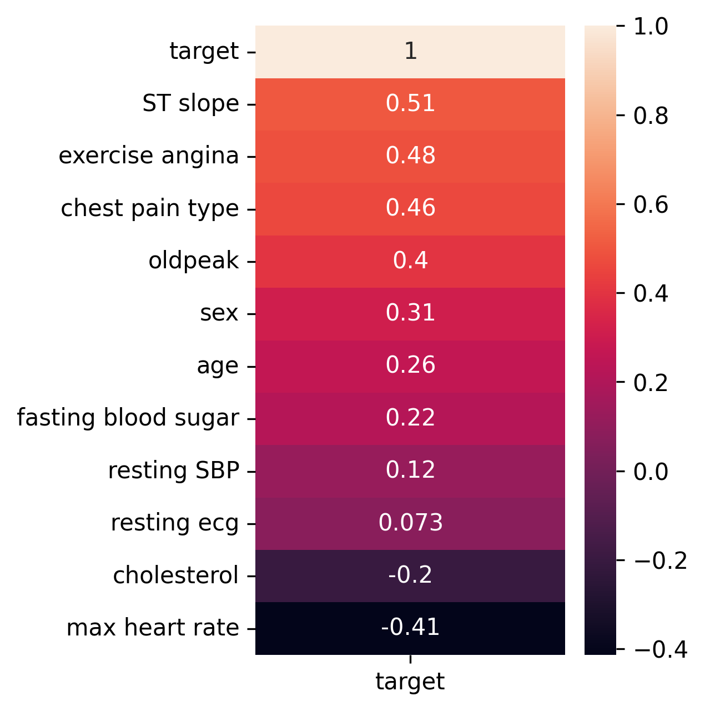
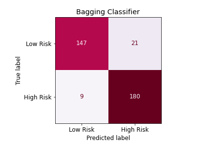
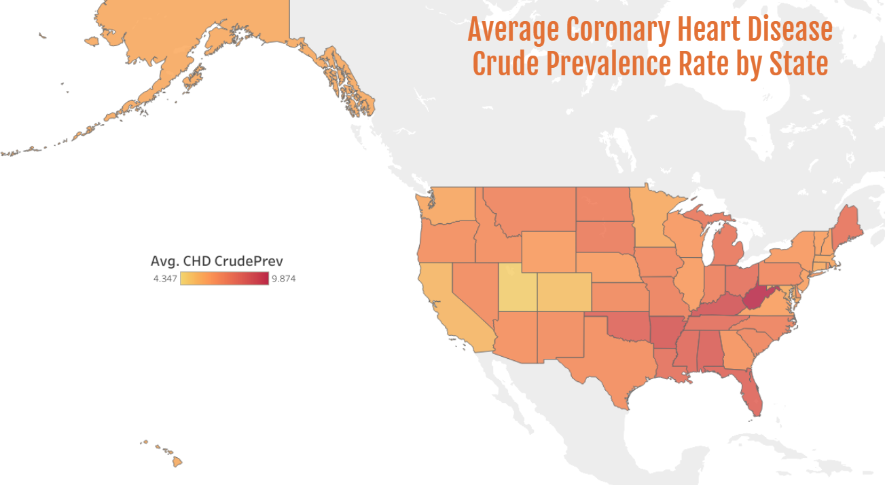

# Project 5: Predicting Patient Risk for Cardiovascular Disease #
## Catherine Clary, Jen Zieger, Basazin Belhu, Thomaz Moon
___
### Sources
1. [Heart Statlog](https://www.kaggle.com/sid321axn/heart-statlog-cleveland-hungary-final)
1. [CHD](https://chronicdata.cdc.gov/500-Cities-Places/PLACES-Census-Tract-Data-GIS-Friendly-Format-2020-/yjkw-uj5s/data)
1. [CDC Heart Disease Facts](https://www.cdc.gov/heartdisease/facts.htm)
1. [WHO: Cardiovascular Diseases](https://www.who.int/health-topics/cardiovascular-diseases#tab=tab_1)
1. [PLACES: Local Data for Better Health](https://www.cdc.gov/places/index.html)
1. [Framingham Risk Score](https://en.wikipedia.org/wiki/Framingham_Risk_Score)
___
### Tables of Contents:
1. [Introduction to Cardiovascular Disease](#s1)
2. [Data Science Problem](#s2)
3. [Collecting & Identifying Data](#s3)
4. [Data Cleaning and Preprocessing](#s4)
5. [Exploratory Data Analysis](#s5)
6. [Model Development](#s6)
7. [Model Evaluation](#s7)
8. [Conclusions and Recommendations](#s8)
9. [CHD analysis](#s9)
10. [Next Steps](#s10)
---------------

#### 1. Introduction to Cardiovascular Disease 

  Cardiovascular diseases (CVD) are a group of disorders of the heart and blood vessels. CVD encompasses a wide range of diseases, including coronary heart disease, cerebrovascular disease, peripheral arterial disease, rheumatic heart disease, and congenital heart disease. According to a recent report by the World Health Organization, more than 80% of CVD deaths are due to heart attacks and strokes. CVD imposes substantial physical and financial burdens in the United States and across the globe. In both the U.S. and globally, CVD is the leading cause of death. CVD accounts for approximately 17.9 million deaths each year worldwide - a figure that is likely underreported due to poor public health systems in low-resourced countries. This striking figure represents 32% of all deaths worldwide, of which 75% are concentrated in middle- and low-income countries. The toll of CVD is immense; 38% of all premature deaths (defined as death under 70 years of age) were due to CVD. These statistics hold true in high-income countries, such as the United States.  Heart disease is the leading cause of death for black, American Indian, Alaska Native, Hispanic, and white men. For women, CVD is second only to cancer as the leading cause of death. According to the most recent statistics released by the Centers for Disease Control, 659,000 Americans die from CVD each year. The financial burden of CVD cannot be ignored; heart disease costs the United States approximately 363 billion each year (according to a CDC estimate from 2016-2017)

  As a result of CVD's substantial morbidity and mortality, copious research on CVD has been performed, especially in high-income countries. Many research studies have focused on predictors of CVD, attempting to identify risk factors for CVD. Researchers have identified numerous behavioral risks for CVD, including an unhealthy diet, physical inactivity, tobacco use, and harmful alcohol use. Our project seeks to expand upon this behavioral research and see what medical predictors are associated with CVD.

#### 2. Data Science Problem 

  We (Group 5: Catherine, Bassa, Jen, Thomaz) are public health researchers and have been tasked with identifying and understanding predictors of CVD in patient populations located in high-income countries.  Our employer, a group of medical professionals, is concerned with high CVD mortality among their patient population and seeks to identify better screening methods for CVD. Therefore, our goal is to identify the predictors most correlated with CVD; this will aid medical professionals in optimizing their CVD screening algorithms.

Data Science Question: Which predictors are associated with CVD?

#### 3. Collecting and Identifying Data 

   We used a Kaggle dataset (found [here](https://www.kaggle.com/sid321axn/heart-statlog-cleveland-hungary-final)) on heart disease entitled "Heart Disease Dataset (Comprehensive)." This data set was amassed using data from patient populations in Cleveland, Hungary, Switzerland, Long Beach, VA, and then was combined with the Stalog Heart Data Set. Eleven features were provided in this data set (please see below data dictionary for a full description) for us to analyze.

   In order to confirm our results, we identified a second data set similar to our first data set on CVD with a focus on coronary heart disease (found [here](https://chronicdata.cdc.gov/500-Cities-Places/PLACES-Census-Tract-Data-GIS-Friendly-Format-2020-/yjkw-uj5s/data)). Once we had developed our models and found the most correlated/associated predictors in our first data set, we then performed a similar analysis on our second data set to see if we got similar results. This second data set was from the Centers for Disease Control's PLACES project in 2020. In addition to features on medical stats (rest blood pressure, cholesterol, etc.), this data set also had information about location, particularly the state in which the patient was located. With this information, we were also able to compare average coronary heart disease risk rates between U.S. states.

#### 4. Data Cleaning and Preprocessing 

   We imported our primary data set into Python in order to preview the dataset's structure and make determinations about how to process the data in advance of modeling. Below is the data dictionary for our primary data set:

| S. No.  | Attribute                                 | Code Given          | Unit            | Data Type |
|---------|-------------------------------------------|---------------------|-----------------|-----------|
| 1       | Age                                       | Age                 | in years        | Numeric   |
| 2       | Sex                                       | Sex                 | 1,0             | Binary    |
| 3       | Chest Pain Type                           | Chest pain type     | 1,2,3,4         | Nominal   |
| 4       | Resting Blood Pressure                    | Resting SBP         | in mm Hg        | Numeric   |
| 5       | Serum Cholesterol                         | Cholesterol         | in mg/dl        | Numeric   |
| 6       | Fasting Blood Sugar                       | Fasting blood sugar | 1.0 > 120 mg/dl | Binary    |
| 7       | Resting Electrocardiogram Results         | Resting ecg         | 0,1,2           | Nominal   |
| 8       | Maximum Heart Rate Achieved               | Max heart rate      | 71-202          | Numeric   |
| 9       | Exercise Induced Angina                   | Exercise Angina     | 0,1             | Binary    |
| 10      | Oldpeak = ST                              | oldpeak             | depression      | Numeric   |
| 11      | The slope of the peak exercise ST segment  | ST slope            | 0,1,2           | Nominal   |
| 12      | Class                                     | Target              | 0,1             | Binary    |

| Attribute                                  | Description                                                                                                                                                                                                               |
|--------------------------------------------|---------------------------------------------------------------------------------------------------------------------------------------------------------------------------------------------------------------------------|
| Sex                                        | 1 = male, 0 = female                                                                                                                                                                                                      |
| Chest Pain Type                            | - Value 1: Typical angina - Value 2: Atypical angina - Value 3: Non-anginal pain - Value 4: Asymptomatic                                                                                                                  |
| Fasting Blood Sugar                        | (Fasting blood sugar > 120 mg/dl) (1 = true; 0 = false)                                                                                                                                                                   |
| Resting Electrocardiogram Results          | - Value 0: normal - Value 1: having ST-T wave abnormality (T wave inversions and/or ST elevation   or depression of > 0.05 mV) - Value 2: showing probable or definite left ventricular hypertrophy by    Estes' criteria |
| Exercise Induced Angina                    | 1 = yes; 0 = no                                                                                                                                                                                                           |
| The Slope of the Peak Exercise ST segment | - Value 1: upsloping - Value 2: flat - Value 3: downsloping                                                                                                                                                                |
| Class                                      | 1 = heart disease, 0 = normal                                                                                                                                                                                             |

We featured engineered interaction terms using the Polyfit transformer. We combined all our newly created polynomial interaction terms with our original features, representing the total features we intended to include in the first iteration of our model(s).

#### 5. Exploratory Data Analysis 

**Categorizing Columns**

  First, we plotted correlation matrices to see which variables were most closely related to our outcome. We plotted a correlation matrix with only our original features and found that `exercise angina` and `oldpeak` had the highest positive correlation with CVD. In contrast, `max heart rate` had the most significant negative correlation with CVD. Next, we plotted a similar correlation matrix using all features (original as well as our feature engineered polynomial variables). In this correlation matrix, `resting SBP * exercise angina`, `age exercise * angina`, `exercise angina ^2`, `exercise angina`, and `sex * exercise angina` had the highest positive correlation score (all having 0.48). The variables with the most significant negative correlation were `resting SBP * max heart rate`, `cholesterol * max heart rate`, `max heart rate`, and `max heart rate ^2`.  This correlation information guided our approach to model development, particularly about prioritizing predictors.

**Keeping Columns Numeric**

   In the original correlation matrix, the variable `ST slope` had the highest correlation at 0.51. `Chest pain type` and `oldpeak` also had high correlation scores. After creating our polynomial features, the highest correlation column was `chest pain type * ST slope` at 0.59, followed by `age * ST slope`, `ST slope`, and `chest pain type * exercise angina` which all had a correlation score of 0.51. We decided to test a number of different data frames (organizing our primary data set slightly differently, including the different number of features, etc.) and passed them into a function that returned a number of different base model scores. From these results, we chose the best "cleaned data" to use moving forward.  

| Categorizing Columns | Keeping Columns Numeric |
|------------------------|-------------------------|
|  |  |

#### 6. Model Development 

   Because our outcome is binary (an individual has CVD or does not have CVD), we used classification models. Hence, we tried Logistic Regression, Bagging Classifier, Ada Boost Classifier, Gradient Boosting, Random Forest, SVC, K-nearest Neighbors, Bernoulli Naive Bayes, Decision Tree, Voting Classifier, and finally, a Neural Network. We obtained the following scores on our training and testing sets:

| Model        | Logistic Regression | Bagging  Classifier | Ada  Boost | Gradient | Random Forest | SVC   | KNN   |
|--------------|---------------------|---------------------|------------|----------|---------------|-------|-------|
| Train  Score | 0.857               | 0.992               | 0.981      | 0.978    | 1.0           | 0.876 | 0.890 |
| Test  Score  | 0.868               | 0.899               | 0.910      | 0.904    | 0.901         | 0.874 | 0.840 |

Next, we performed a Grid Search on our models to identify the best parameters and obtain the best possible score(s).  The results of these searches (i.e., our new scores) are presented in the following table:

| Model        | Logistic Regression | Ada  Boost | Gradient | Random Forest | KNN   | Bernoulli Naive Bayes | Decision Tree | Neural  Network | Voting |
|--------------|---------------------|-----------------------|---------------|-------|-----------------------|---------------|-----------------|--------|-
| Train  Score | 0.858               | 0.941      | 1.0      | 1.0           | 1.0   | 0.745                 | 1.0           | 0.912           | 0.948  |
| Test  Score  | 0.868               | 0.885      | 0.927    | 0.915         | 0.829 | 0.742                 | 0.927         | 0.890           | 0.896  |

The majority of our models performed better once the Grid Searches were performed. However, our Random Forest model scores did not change (we likely identified the best parameters in our first iteration), and the Bagging Classifier and Ada Boost scores worsened.

#### 7. Model Evaluation 

   After our first model iterations and Grid Searches, the top three performing models were: Random Forest, Gradient Boost, and Ada Boost. For our Random Forest model, we obtained an accuracy score of 1.0 on our training set and 0.910 on our testing set; our Grid Search obtained the same score, revealing no improvement over our base model. Our best performing Gradient Boost model obtained an accuracy score of 0.991 on our training data and 0.947 on our testing set. Our Ada Boost model obtained an accuracy score of 0.985 on our training data and 0.905 on our testing data.

   Next, we performed additional evaluation metrics in order to best evaluate our results. Because our outcome is binary, we chose to also look at recall and precision - metrics that identify false negatives and false positives. This indicates if we have correctly predicted the correct outcome for each observation.  For our Random Forest model, we obtained a recall of 0.936508 and a precision of 0.907692. For our Gradient Boost model, our best model received a recall of 0.952381 and a precision of 0.913706. Finally, our Voting Classifier model obtained a recall of 0.915344 and a precision of 0.891753. We decided to focus on both accuracy and recall (or sensitivity) as evaluation metrics, as it would be worse for someone with CVD to be misdiagnosed as CVD negative because then they would miss (or delay) initiation on the treatment of life-saving medications. Therefore, we prioritized models with high sensitivity when choosing our final model.  

|Gradient Boost (Higher Precision) | Bagging Classifier (Higher Recall)|
|:--------------------------------:|:---------------------------------:|
| | |

#### 8. Conclusions and Recommendations 
  For our Gradient descent model, the most important predictor was `resting SBP * ST slope` (Resting bp is resting systolic blood pressure & ST slope is a measurement of how well one's heart handles exercise). This feature alone made up almost 30% of our models' predictive ability.  In other words, the most prominent predictive factor for heart disease, according to our model, is whether an individual has a high resting systolic blood pressure along with how well their heart can handle exercise.  The next three most important features for our model were `sex * ST slope` which accounted for 7.1% for our model's prediction, followed by `sex * chest pain type`, which accounted for 6.75% of our model's predictive ability, and `chest pain type * resting SBP` which accounted for 6.41% of our model's predictive ability.

  By identifying these key predictors that are most predictive of CVD in patients (in high-income countries), medical professionals will be able to more quickly and accurately identify patients most likely to have CVD.  Not only will this improve the speed at which individuals are initiated on treatment (and hence improve their health outcomes), but it will free up doctors' time to treat other patients needing treatment -- ultimately benefiting the total patient population.

#### 9. Additional CHD Analysis 

  **Exploratory Analysis**

  In addition to our primary dataset evaluation, we performed a high-level analysis and modeling on the CDC PLACES Coronary Heart Disease (CHD) dataset to see what predictors have the highest impact on the crude prevalence of coronary heart disease in the U.S.

  The top two positively correlated values with the crude prevalence of coronary heart disease are the crude prevalence of chronic obstructive pulmonary disease (0.91) and the crude prevalence of kidney disease (0.89). As the crude prevalence of chronic obstructive pulmonary disease and/or kidney disease increases, the crude prevalence of coronary heart disease increases.

  **Modeling**

  We used both classification and regression modeling for this supplementary dataset, predicting the crude prevalence risk of coronary heart disease. Models tested included Linear Regression, Ridge Regression, Lasso Regression, Logistic Regression, K-nearest neighbors, and Bernoulli Naive Bayes. For our classification models, we separated low-risk and intermediate to high-risk CHD, based on the Framingham Risk Score where a crude prevalence of CHD score of less than 10 means someone is at low-risk, and the crude prevalence of someone with a score of 10 or higher indicates they have intermediate to high-risk for crude prevalence of CHD.

  Since we were aligning this supplementary dataset with our CVD dataset, we based our findings on our best-performing classification model, Logistic Regression. This model was the best performing overall with a 0.987 train accuracy and 0.985 test accuracy. We have high recall and precision scores, indicating we were reasonably successful in predicting false positives and false negatives. We misclassified approximately 1.5% of the risk ratings. We were more successful in predicting false negatives vs. false positives, but are performing reasonably well overall.

  **CHD Conclusions**

  Through our CHD evaluation, we would expect that the crude prevalence of kidney disease, chronic obstructive pulmonary disease, and/or cancer would increase the risk of an individual's crude prevalence of coronary heart disease.

  Washington D.C. had the lowest average crude prevalence risk rate for coronary heart disease amongst all states in the U.S. We used Washington D.C. as our reference column when evaluating the average risk rates in other states. We expect the crude prevalence of coronary heart disease to increase by .707789 for a person living in the state of West Virginia, and the crude prevalence of heart disease to increase by 0.619679 for a person living in the state of Kentucky compared to someone living in Washington D.C, all else being constant.

  

  By evaluating similar features to the CVD dataset, we concluded that for every 1 unit increase in crude prevalence of poor physical health, we would expect the crude prevalence of coronary heart disease to increase by 3.019379, for every 1 unit increase in crude prevalence of high cholesterol, we would expect the crude prevalence of coronary heart disease to increase by 1.257013, and for every 1 unit increase in crude prevalence of high blood pressure, we would expect the crude prevalence of coronary heart disease to decrease by -0.561533, all else being constant.

#### 10. Next Steps 

In future iterations of our model, we would like to train our model on more diverse populations. Our current data set(s) primarily focus on populations in high-income countries, but ideally, we would like our results to be generalizable to a larger population. Therefore, collecting data on more diverse populations, specifically on age, sex, socio-economic status, race, and location, would help us build a build that can generalize to more people. Having more data (more diverse data or simply data in general) would be the best way to improve our model and its predictive ability.

We would also look at collecting data for a larger sample size, as our CVD dataset represented 1190 people.

We would also recommend collecting data on other subsets of CVD to gather more information on other potential risk factors that may not have been in our scope. Subsets may include Cerebrovascular Disease, Peripheral Arterial Disease, Rheumatic Heart Disease, Congenital Heart Disease.

After collecting supplementary data, we would need to train our model and fine-tune the hyperparameters. After the model has been trained, we would recommend deploying the model with the best performance for beta testing in hospitals or other health care facilities.
